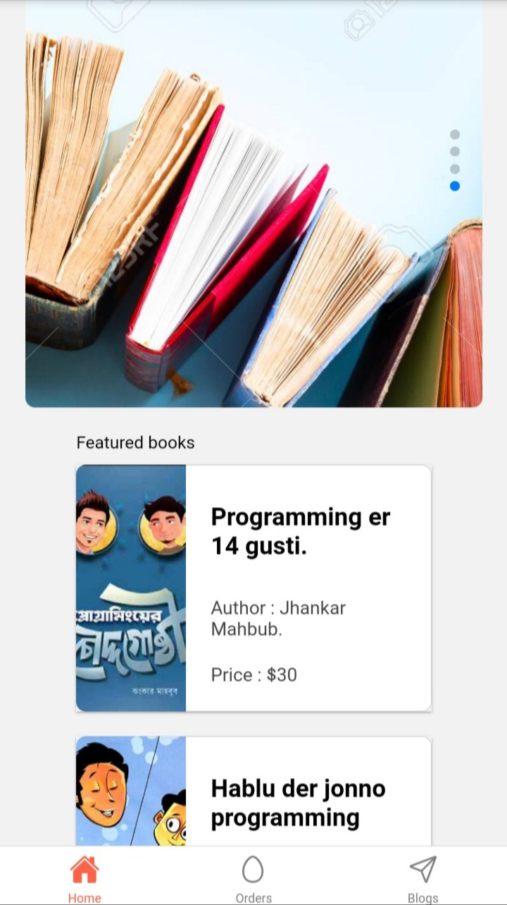
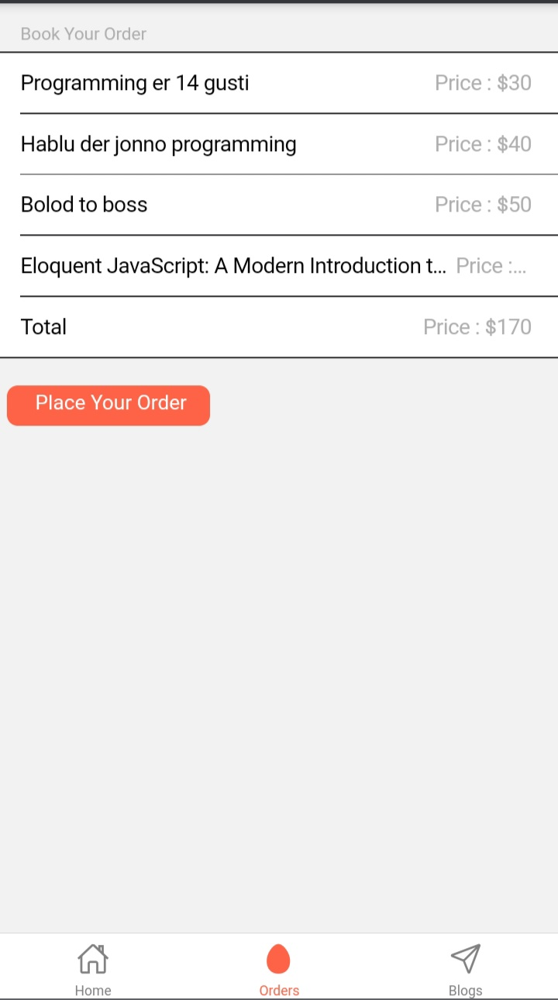
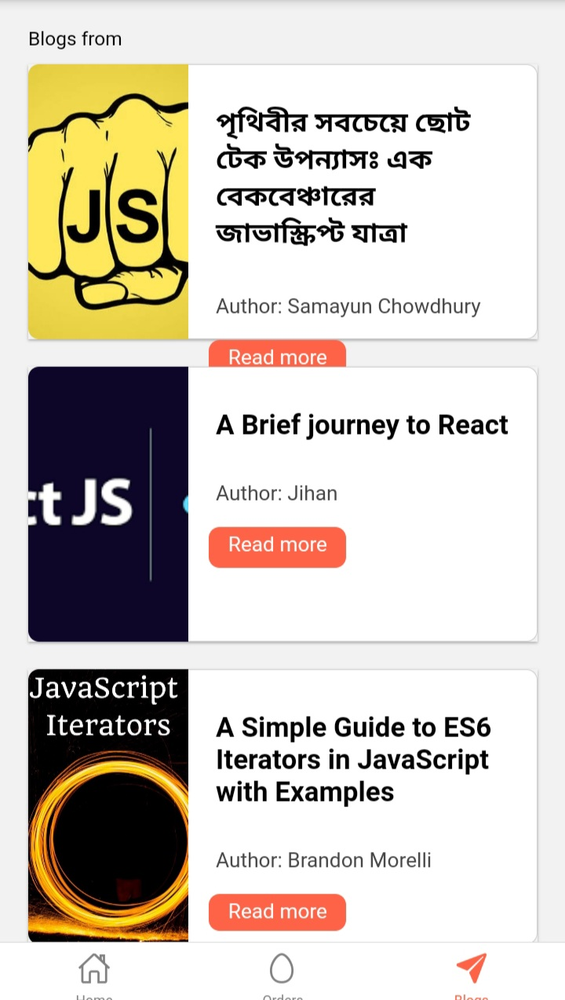
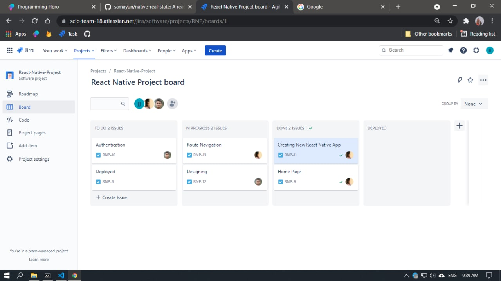
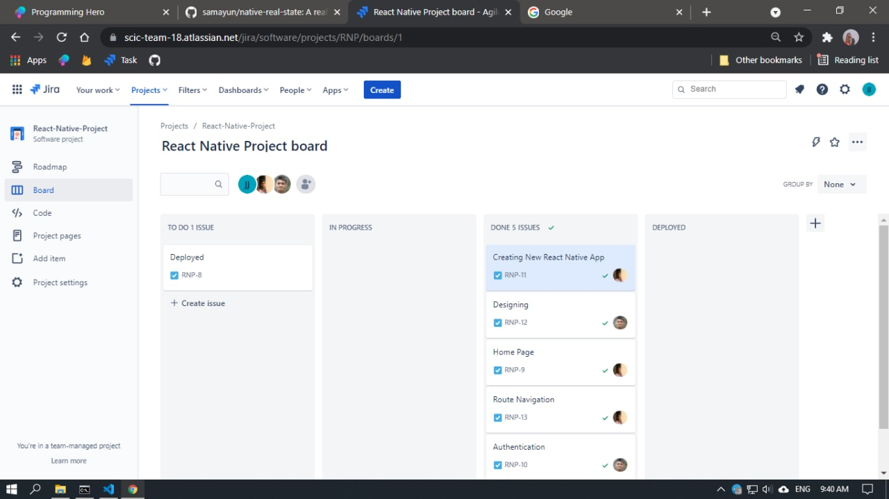

# BookShop react-native

A bookshop mobile application build on react native .

## Features in project

- You can see books in home page.
- You can see orders in order page.
- You can see blogs in blog page.
- From blog page you can go to main blog by clicking “Read More” button

# :clap: Screens

- HomePage :
  

- OrderPage :
  

- BlogPage

  

##  How to run this project

- `git clone https://github.com/samayun/native-real-state.git native-real-state`
- `cd native-real-state`

* If `expo-cli` is not installed yet . run command `npm install --global expo-cli`

- `npm install` (will install all node packages [INTERNET Connection Need])
- `npm start`

##  How to Contribute this project

## [How to contribute](https://www.dataschool.io/how-to-contribute-on-github)

1. Git clone :

   - `git clone https://github.com/samayun/native-real-state.git native-real-state`

2. Navigate Project `cd native-real-state`
3. `git checkout -b BRANCH_NAME` eg `git checkout -b samayun`
4. `git fetch -u master`
5. Git commit , pull & push

- `git add .`
- `git commit -m "[improve]:Navigation screen added"`
- `git fetch && git pull origin master`
- `git push origin BRANCH_NAME` eg : `git push origin samayun`

Project manged by JIRA

- Day1
  

- Day2
  

## Contributors

<a 
  href="https://github.com/samayun" 
  target="_blank" 
  style="display:flex;align-items:center;justify-content: left;"
  rel="noopener">

<strong 
    style="padding:5px;"> Samayun Miah Chowdhury
</strong> [ @samayun ]
</a>

<a href="https://github.com/pritom-dip" target="_blank" 
style="display:flex;align-items:center;justify-content: left;"
rel="noopener">

<strong 
    style="padding:5px;"> Pritom Chowdhury Dip
</strong> [ @pritom-dip ]
</a>
 
<a href="https://github.com/jihan212" target="_blank" 
style="display:flex;align-items:center;justify-content: left;"
rel="noopener">

<strong 
    style="padding:5px;"> JIhan Binte Jashim
</strong> [ @jihan212 ]
</a>
